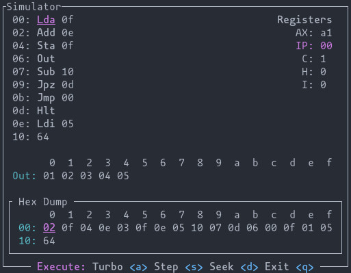

Busyboard
=========

This is a simulator of a fictitious minimalist 8-bit processor with a TUI.

## Getting Started
Install rust and run `cargo run`. Alternatively, if you use nix with flakes enabled, run
`nix develop`.
